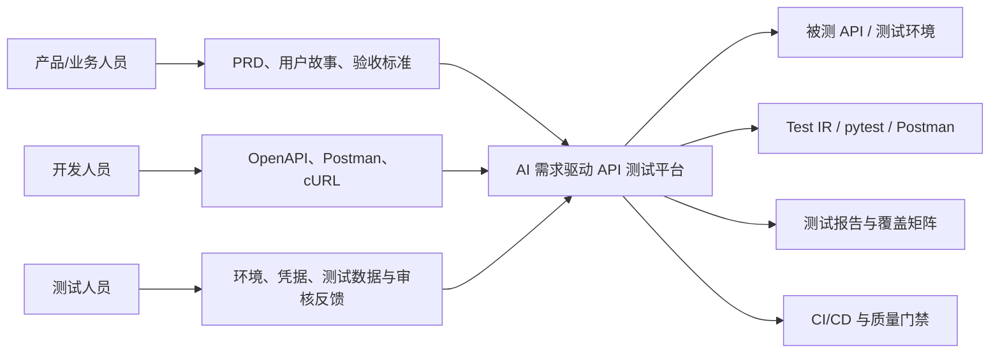
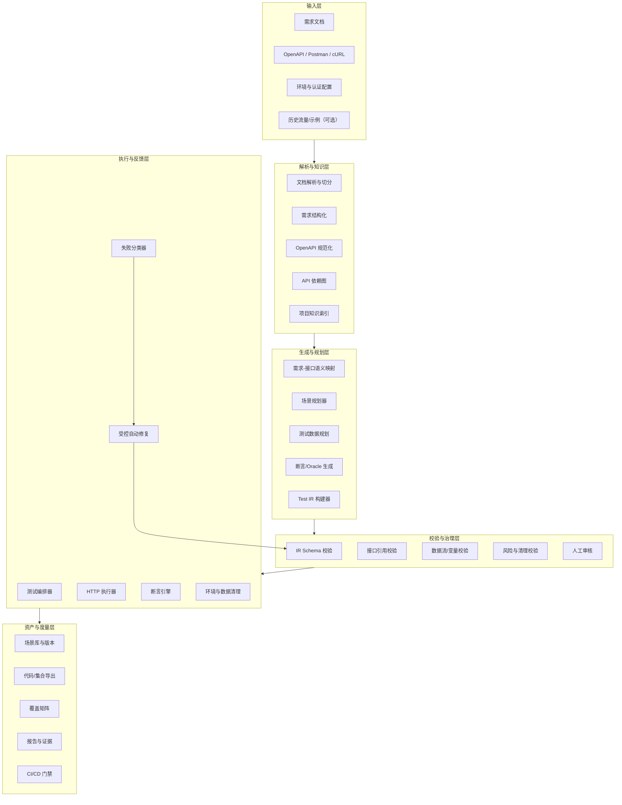
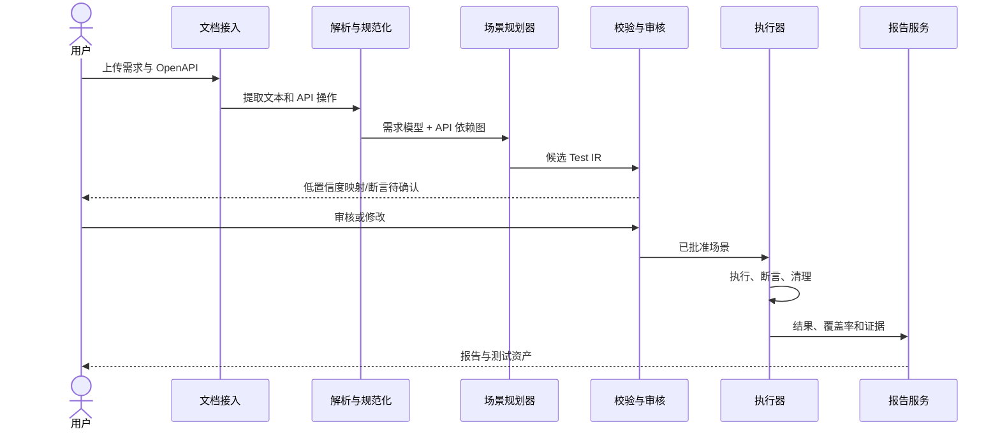

# AI 需求驱动 API 自动化测试平台——总体设计架构大纲

> 文档状态：初稿  
> 版本：0.1.0  
> 更新日期：2026-08-19  
> 适用范围：MVP 至 V1

## 1. 文档目的

本文档定义一套“根据业务需求文档与 API 接口文档，自动构建、执行和维护 API 测试链路”的平台架构，为产品设计、技术选型、研发拆分和后续架构评审提供统一基线。

平台的核心产物不是一次性的 LLM 测试代码，而是可审计、可校验、可执行、可版本化的结构化测试模型 Test IR（Intermediate Representation）。

## 2. 产品目标与边界

### 2.1 建设目标

1. 解析 OpenAPI 3.0/3.1、Postman Collection、cURL 等接口资料，形成标准 API 操作模型。
2. 解析 PRD、用户故事、验收标准等业务资料，提取需求、规则、前置条件和预期结果。
3. 自动建立“需求—接口—字段—依赖”的映射关系。
4. 自动规划包含多个 API 调用的业务测试场景，并处理上下游数据传递。
5. 自动生成正向、异常、边界、权限和跨接口一致性测试。
6. 在隔离环境中执行测试，分类失败原因，并在受控次数内自动修复测试。
7. 输出需求覆盖率、接口覆盖率、参数覆盖率、状态码覆盖率及可复现证据。
8. 支持将已审核场景导出为 pytest/Jest/Postman 等可维护测试资产。

### 2.2 MVP 范围

- REST + JSON API。
- OpenAPI 3.0/3.1 文件或 URL。
- Markdown、TXT、DOCX 需求文档；PDF 仅支持文本型 PDF。
- API Key、Bearer Token、静态 Header；复杂 OAuth/OIDC 通过用户脚本扩展。
- 单场景 1～5 个主要 API 步骤。
- 正向、负向、边界、跨接口一致性测试。
- 结构化 Test IR、内置执行器、pytest 导出。
- 单租户私有化部署优先。

### 2.3 非目标

- MVP 不覆盖 Web UI、移动端 UI 和桌面端 UI 自动化。
- MVP 不负责自动生成完整测试环境和业务依赖系统。
- 不承诺无人工审核即可验证所有业务语义。
- 不直接在生产环境执行破坏性测试。
- MVP 不引入多智能体强化学习和大规模搜索训练。

## 3. 架构原则

### 3.1 确定性优先

OpenAPI 校验、字段类型、边界值、数据绑定、表达式执行、测试运行和报告生成均由确定性程序负责。LLM 主要用于自然语言理解、语义映射和候选场景规划。

### 3.2 结构化中间表示

LLM 不直接生成最终测试代码，必须先输出符合 JSON Schema 的 Test IR。Test IR 通过静态校验、引用校验、安全校验后才能进入执行器。

### 3.3 全链路可追溯

每条测试必须保留以下来源关系：

```text
需求条款 → 业务规则 → 测试场景 → API operationId → 测试步骤 → 断言 → 执行证据
```

### 3.4 人在回路

高风险调用、低置信度映射、业务断言、生产类环境执行和自动修复结果必须支持人工审批。

### 3.5 安全默认

默认拒绝生产域名；写操作必须具备清理方案或显式审批；凭据仅通过密钥管理模块注入，禁止进入提示词、日志和测试产物。

### 3.6 可插拔

文档解析器、模型提供商、测试数据生成器、认证插件、执行器、导出器和报告器均通过稳定接口扩展。

## 4. 系统上下文



## 5. 总体逻辑架构



## 6. 核心领域模型

### 6.1 主要实体

| 实体 | 说明 | 关键字段 |
|---|---|---|
| Project | 测试项目 | id、name、settings、risk_policy |
| Document | 原始需求/API 文档 | type、version、checksum、source_uri |
| Requirement | 原子化需求条款 | requirement_id、text、source_location、priority |
| BusinessRule | 可验证业务规则 | condition、expected_behavior、confidence |
| ApiSpec | 规范化接口版本 | openapi_version、base_urls、checksum |
| ApiOperation | 单个接口操作 | operation_id、method、path、schemas |
| DependencyEdge | API 数据依赖 | producer、consumer、binding、confidence |
| TestScenario | 测试场景 | requirement_refs、risk、status、version |
| TestStep | API/脚本/等待步骤 | operation_ref、inputs、extracts、on_failure |
| Assertion | 测试断言 | expression、source、severity、confidence |
| TestRun | 一次执行 | environment、status、started_at、trigger |
| StepResult | 步骤执行结果 | request_ref、response_ref、latency、error |
| Evidence | 脱敏证据 | request、response、logs、trace_id |

### 6.2 Test IR 示例

```yaml
schema_version: "1.0"
scenario_id: ORDER-102-S01
name: 创建订单后库存减少
requirement_refs:
  - id: ORDER-102
    source: requirements/order.md#L32
risk_level: medium
preconditions:
  - type: auth
    profile: customer
variables:
  order_quantity:
    type: integer
    value: 2
steps:
  - id: create_product
    type: api
    operation_id: createProduct
    input:
      body:
        name: "test-${run.id}"
        stock: 10
    extract:
      product_id: "$.body.id"
      initial_stock: "$.body.stock"
    assertions:
      - type: status
        expected: 201

  - id: create_order
    type: api
    operation_id: createOrder
    input:
      body:
        productId: "${product_id}"
        quantity: "${order_quantity}"
    extract:
      order_id: "$.body.id"

  - id: get_inventory
    type: api
    operation_id: getInventory
    input:
      path:
        productId: "${product_id}"
    assertions:
      - id: inventory_decreased
        type: expression
        source: requirement
        expression: "response.body.available == initial_stock - order_quantity"
cleanup:
  - operation_id: deleteOrder
    input:
      path:
        orderId: "${order_id}"
  - operation_id: deleteProduct
    input:
      path:
        productId: "${product_id}"
```

### 6.3 Test IR 校验规则

1. 所有 `operation_id` 必须在当前 ApiSpec 中存在。
2. 请求字段必须符合对应 OpenAPI Schema。
3. 变量使用前必须已定义或已提取。
4. JSONPath 必须可静态解析；运行时提取失败应产生明确错误。
5. 表达式只允许白名单语法，不允许任意代码执行。
6. POST/PUT/PATCH/DELETE 默认要求清理步骤或豁免理由。
7. 需求型断言必须包含来源引用和置信度。
8. Secret 只允许通过 `${secret.<name>}` 引用。

## 7. 核心模块设计

### 7.1 文档接入模块

职责：

- 上传、URL 拉取、版本管理和内容校验。
- DOCX/PDF/Markdown/TXT 文本抽取。
- 标题、段落、表格、编号、源位置保留。
- 文档敏感信息检测和提示。

输出：标准化 Document Chunk，不直接输出测试。

### 7.2 需求结构化模块

职责：

- 将需求拆分成原子条款。
- 提取角色、触发条件、前置条件、输入、业务规则、验收结果和异常行为。
- 标记歧义、冲突和缺失信息。
- 为每条需求生成稳定 ID 和来源定位。

LLM 输出必须通过结构化 Schema 校验；低置信度结果进入待确认队列。

### 7.3 API 规范化模块

职责：

- 解析 OpenAPI 3.0/3.1。
- 展开或索引 `$ref`，保留原始位置。
- 统一参数、请求体、响应、认证和服务器定义。
- 对缺少 `operationId` 的接口生成稳定内部 ID。
- 检查规范完整性和自动测试就绪度。

### 7.4 API 依赖图模块

节点为 ApiOperation，边表示数据或状态依赖。依赖来源按可信度排序：

1. OpenAPI Links、Callbacks 和明确引用。
2. 请求/响应 Schema 引用关系。
3. 字段名、类型和描述的静态匹配。
4. 需求描述中的顺序和语义关系。
5. 历史请求响应和运行反馈。
6. LLM 推断的候选依赖。

低置信度依赖不得直接用于高风险写操作。

### 7.5 需求—接口映射模块

采用“确定性筛选 + 语义检索 + LLM 重排”的组合：

- 根据资源名、operationId、Tag、路径和字段做初筛。
- 对大型规范按 Operation 粒度建立向量或全文索引。
- 由模型输出候选操作、映射理由、置信度和缺失信息。
- 强制模型只引用已检索到的 operationId。

### 7.6 场景规划器

根据需求、依赖图和测试策略模板生成候选场景：

- Happy path。
- 业务异常。
- 字段边界和非法输入。
- 权限与角色隔离。
- 创建—查询—更新—删除生命周期。
- 跨接口数据一致性。
- 幂等性、重试和重复提交。

规划器输出 Test IR，不输出 pytest 源码。

### 7.7 测试数据规划模块

数据来源优先级：

1. 用户提供的固定测试数据。
2. 需求中的具体示例。
3. OpenAPI `example`、`examples`、`enum`、`default`。
4. 前序步骤响应。
5. 约束驱动生成器。
6. LLM 候选数据。

PII、密钥和真实生产数据不得由 LLM 直接生成或回显。

### 7.8 Oracle 与断言引擎

断言分为：

- 合约断言：状态码、Content-Type、响应 Schema、必需 Header。
- 通用断言：无 5xx、响应时间阈值、认证有效性。
- 状态断言：创建后可查询、删除后不可访问。
- 业务断言：来自需求的金额、库存、状态、权限等规则。
- 跨步骤断言：前后值比较、集合包含、资源一致性。

每个断言必须标明 `source=spec|requirement|platform|user`。

### 7.9 测试执行模块

职责：

- 按 DAG/顺序执行场景。
- 注入认证、环境变量和 Secret。
- 管理变量上下文、提取表达式和重试。
- 支持场景超时、步骤超时、速率限制和并发控制。
- 无论成功失败均执行 `finally cleanup`。
- 生成脱敏 HAR、JUnit 和平台原生报告。

### 7.10 失败分类与自动修复

失败类别：

| 类别 | 示例 | 默认动作 |
|---|---|---|
| API_DEFECT | 返回值违反需求或接口出现 5xx | 保留证据，禁止自动改断言 |
| SPEC_DEFECT | 实际响应与 OpenAPI 不一致 | 标记文档问题 |
| TEST_DEFECT | 变量未绑定、路径错误、数据不合法 | 可自动修复 |
| ENVIRONMENT | Token 失效、依赖不可达 | 停止并提示 |
| FLAKY | 超时、非确定性数据 | 重跑并计算稳定性 |
| UNKNOWN | 无法分类 | 人工审核 |

自动修复最多两轮，只允许修改 Test IR 中的测试实现部分，不得静默放宽需求断言。

## 8. 关键业务流程

### 8.1 首次生成流程



### 8.2 文档变更流程

1. 对新旧文档做结构化 Diff。
2. 定位受影响 Requirement、ApiOperation、DependencyEdge 和 Scenario。
3. 将场景标记为新增、需重生成、需复核或已失效。
4. 只对受影响场景执行增量生成。
5. 人工确认业务断言变化后创建新场景版本。

## 9. 数据与存储架构

### 9.1 建议存储

- PostgreSQL：项目、需求、API 操作、场景、运行记录、审核记录。
- 对象存储：原始文档、脱敏请求响应、报告、导出包。
- Redis：任务队列、短期执行上下文、分布式锁。
- 全文/向量索引：MVP 可用 PostgreSQL FTS + pgvector，避免过早引入独立向量数据库。
- Secret Manager：Vault、Kubernetes Secret 或云厂商 KMS。

### 9.2 版本策略

- Document、ApiSpec、Requirement、TestScenario 均不可覆盖更新，采用版本化记录。
- TestRun 必须引用确定的 Scenario Version、ApiSpec Version 和 Environment Version。
- LLM 调用记录模型、提示模板版本、检索文档 ID 和输出摘要，敏感原文按策略脱敏或不留存。

## 10. 服务与接口划分

MVP 推荐“模块化单体 + 独立 Worker”，暂不拆分大量微服务：

```text
api-server
├── projects
├── documents
├── requirements
├── api-specs
├── scenarios
├── reviews
├── runs
└── reports

worker
├── document-parser
├── llm-planner
├── ir-validator
├── test-runner
└── exporter
```

核心 API 示例：

| 方法 | 路径 | 用途 |
|---|---|---|
| POST | `/projects` | 创建项目 |
| POST | `/projects/{id}/documents` | 上传需求文档 |
| POST | `/projects/{id}/api-specs` | 导入 OpenAPI |
| POST | `/projects/{id}/analysis` | 启动解析与映射 |
| GET | `/projects/{id}/requirements` | 获取结构化需求 |
| POST | `/projects/{id}/scenarios:generate` | 生成候选场景 |
| PATCH | `/scenarios/{id}` | 人工编辑 Test IR |
| POST | `/scenarios/{id}:approve` | 审批场景 |
| POST | `/runs` | 执行测试 |
| GET | `/runs/{id}` | 查询执行状态与报告 |
| POST | `/projects/{id}/exports` | 导出 pytest/Postman |

## 11. AI 与模型治理

### 11.1 模型调用原则

- 统一 LLM Gateway，支持 OpenAI-compatible API、本地 Ollama/vLLM。
- 强制结构化输出和 JSON Schema 校验。
- Prompt 中只提供相关需求片段和相关 API Operation，避免整份规范直接灌入。
- 对输入做 Prompt Injection 检测；文档内容只能作为数据，不能覆盖系统指令。
- 输出中出现未知 operationId、未知字段或未知变量立即拒绝。
- 为所有模型输出记录置信度、证据引用和模型版本。

### 11.2 RAG 策略

- 按 Requirement 和 ApiOperation 两类对象分别索引。
- API Chunk 必须保持 operation、request schema、response schema 和认证上下文完整。
- 先关键词/结构化过滤，再做向量召回，最后由模型重排。
- 召回结果必须携带稳定 ID，禁止只返回自然语言片段。

### 11.3 模型评测集

建立内部 Golden Set，至少覆盖：

- 需求拆分正确率。
- 需求—接口映射 Precision/Recall。
- Test IR Schema 有效率。
- 一次执行成功率。
- 业务断言准确率。
- 失败分类准确率。
- 自动修复成功率及错误放宽断言率。

## 12. 安全设计

1. 环境分级：local、dev、test、staging、production；production 默认禁止。
2. 域名和网段 Allowlist，防止 SSRF 和误扫内网。
3. Secret 仅在执行时注入，日志统一脱敏。
4. 执行 Worker 使用容器隔离、只读文件系统和资源限额。
5. 表达式引擎禁止 `eval` 和任意脚本执行。
6. 上传文件做类型、大小、病毒和压缩炸弹检查。
7. 所有审批、执行、导出和 Secret 使用保留审计日志。
8. 写请求速率限制、最大场景步数、最大并发和全局熔断。
9. 清理失败必须突出告警，并保留资源标识供人工处理。

## 13. 可观测性

### 13.1 技术指标

- 任务排队与处理时长。
- LLM 请求次数、Token、费用、超时和结构化输出失败率。
- 场景执行耗时、成功率、重试率和清理失败率。
- API 调用状态码分布、P95/P99 延迟。
- Worker CPU、内存、并发和任务积压。

### 13.2 产品指标

- 需求覆盖率。
- API Operation 覆盖率。
- 生成场景接受率。
- 无人工修改可执行率。
- 业务断言人工修改率。
- 有效缺陷发现率与假阳性率。
- 文档变更后的增量更新率。

## 14. 非功能需求

| 分类 | MVP 指标 |
|---|---|
| 可用性 | 核心 API 月可用性不低于 99.5% |
| 性能 | 100 个 Operation 的规范解析 P95 小于 30 秒，不含模型时间 |
| 生成 | 单条需求候选场景生成 P95 小于 180 秒 |
| 执行 | 支持单项目至少 10 个场景并发，可配置限流 |
| 扩展性 | 文档解析器、模型和导出器可通过插件接口增加 |
| 可恢复性 | Worker 失败后任务可重试，运行状态不丢失 |
| 可审计性 | 测试产物可追溯至文档、模型、场景和执行版本 |
| 隐私 | Secret 不进入模型上下文；日志与证据可配置保留期 |

## 15. 推荐技术栈

| 层次 | 推荐方案 |
|---|---|
| 后端 | Python 3.12、FastAPI、Pydantic |
| 异步任务 | Celery/Dramatiq + Redis，或 Temporal（V1） |
| 数据库 | PostgreSQL + pgvector |
| API 解析 | openapi-spec-validator、prance 或自研标准化层 |
| 图模型 | NetworkX；规模增大后再评估图数据库 |
| 测试生成 | Schemathesis + Hypothesis |
| HTTP 执行 | httpx |
| 表达式 | JSONPath + 受限 CEL/JMESPath |
| 报告 | JUnit XML、Allure、平台原生报告 |
| 前端 | React/Next.js + TypeScript |
| 部署 | Docker Compose；V1 支持 Kubernetes |
| 可观测性 | OpenTelemetry + Prometheus + Grafana |

## 16. 分阶段演进

### 阶段一：MVP

- OpenAPI + Markdown/DOCX。
- 需求结构化、接口映射、依赖图。
- Test IR、人工审核、内置执行。
- pytest 导出和覆盖矩阵。

### 阶段二：V1

- Postman、历史流量、录制回放。
- OAuth 插件、数据库校验、消息队列步骤。
- 文档 Diff 和增量场景更新。
- CI/CD 门禁和缺陷系统集成。

### 阶段三：V2

- 多服务端到端链路。
- 基于运行反馈的依赖图学习。
- 测试优先级智能调度。
- 受控的探索式测试和状态空间搜索。
- UI 测试与 API 测试链路融合。

## 17. 主要架构风险与对策

| 风险 | 影响 | 对策 |
|---|---|---|
| 需求含糊导致错误断言 | 假阳性或漏测 | 歧义检测、置信度、人工审批 |
| OpenAPI 质量差 | 无法构造有效请求 | 就绪度评分、示例补充、运行反馈 |
| LLM 产生不存在的接口/字段 | 无法执行 | ID 约束、IR Schema、静态引用校验 |
| 测试数据污染环境 | 高风险 | 命名隔离、清理计划、环境策略 |
| 自动修复掩盖真实缺陷 | 严重漏报 | 禁止自动放宽需求断言，保留 Diff |
| 大型规范上下文过大 | 成本和准确率下降 | Operation 级索引、结构化过滤、RAG |
| 私有数据外发 | 合规风险 | 本地模型、脱敏、可配置零留存 |

## 18. 待评审决策

1. MVP 是否只支持 pytest 导出，还是同时支持 Postman。
2. 是否允许用户编写受限 Python Hook；若允许，需要独立沙箱。
3. PDF OCR 是否属于 MVP。
4. 是否提供 SaaS，还是优先私有化部署。
5. Test IR 是否对外作为稳定开放标准。
6. 是否在 MVP 集成 Schemathesis，还是先实现最小约束生成器。

